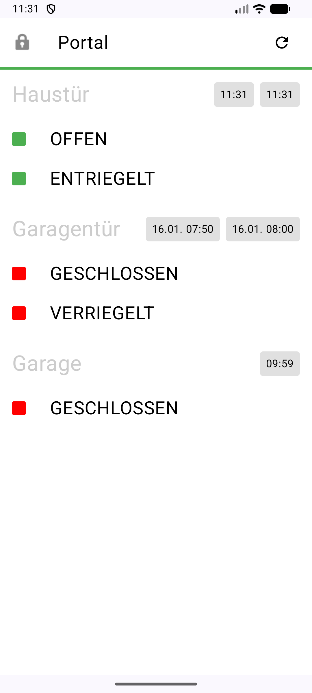
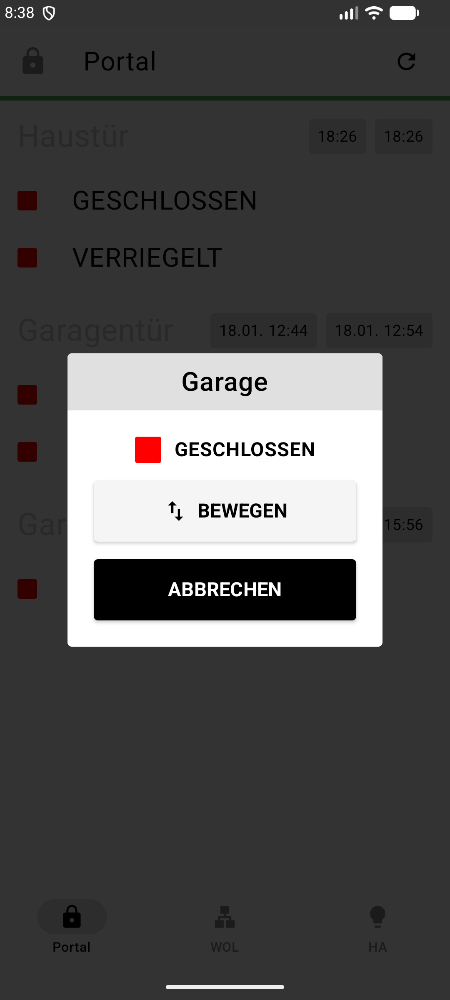
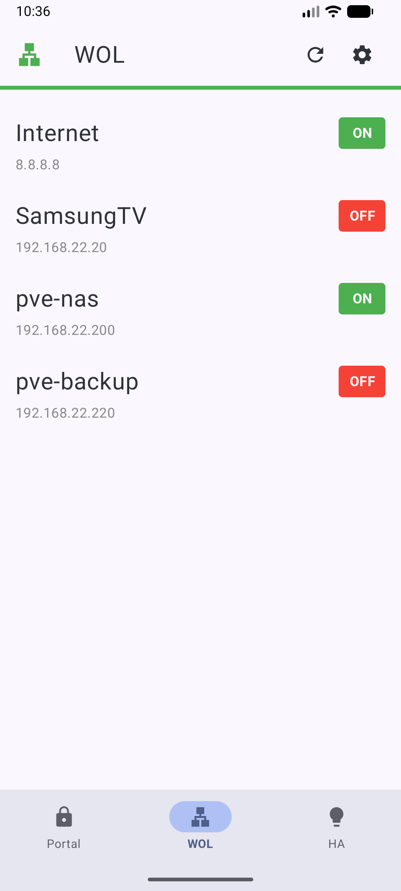

#  MuhPortal

A cross-platform application built with Flutter to monitor and control various portals (doors and locks) via MQTT over WebSockets.

## Features

- **Real-time Monitoring**: Subscribes to JSON status updates for multiple portals.
- **Command Control**: Sends toggle and state commands to garage and house doors.
- **Connection Management**: 
    - Automatic reconnection logic.
    - Visual connection status bar (Green for connected, Red for disconnected).
 - **Payload Parsing**: Extracts door states and original timestamps from MQTT messages.
- **Cross-Platform**: Runs on web, Android, iOS, desktop (Windows, macOS, Linux).

## Screenshots

<p align="center">
  
  
  
</p>

## Technical Specifications

- **Framework**: Flutter (Dart)
- **MQTT Library**: mqtt_client
- **Storage**: shared_preferences
- **Protocol**: MQTT over WebSockets (`ws://192.168.22.5:1884`)
- **IDE**: VS Code, Android Studio, or IntelliJ IDEA with Flutter plugin

## MQTT Architecture

### Subscriptions
The app monitors topics with the pattern: `muh/portal/{KEY}/json`
- `G`: Garage
- `GD`: Garage Door
- `GDL`: Garage Door Lock
- `HD`: House Door
- `HDL`: House Door Lock

### Commands
Commands are published to: `muh/portal/RLY/cmnd`
The following commands are supported:
- `G_T`: Garage Toggle
- `GD_O` / `GD_U` / `GD_L`: Garage Door Open/Unlock/Lock
- `HD_O` / `HD_U` / `HD_L`: House Door Open/Unlock/Lock

## Data Structure

Portal updates are received as JSON and mapped to the `PortalUpdate` data class:
- **ID**: The portal key (e.g., "G", "HD").
- **State**: `OPEN`, `CLOSED`, or `UNKNOWN`.
- **Timestamp**: Extracted from the MQTT payload using various date formats or fallback to system time.

## Installation

### Prerequisites
- Flutter SDK (3.0.0 or higher)
- Dart SDK
- For web: Any modern web browser
- For mobile: Android SDK or Xcode (for iOS)

### Setup

1. Clone the repository:
   ```bash
   git clone https://github.com/13/muhportal.git
   cd muhportal
   ```

2. Install dependencies:
   ```bash
   flutter pub get
   ```

3. Ensure the MQTT broker is accessible at the configured URI (`ws://192.168.22.5:1884`).

4. Run the application:
   
   **For Web:**
   ```bash
   flutter run -d chrome
   ```
   
   **For Android:**
   ```bash
   flutter run -d android
   ```
   
   **For iOS:**
   ```bash
   flutter run -d ios
   ```
   
   **For Desktop:**
   ```bash
   flutter run -d windows  # or macos, linux
   ```

### Building for Production

**Web:**
```bash
flutter build web
```

**Android APK:**
```bash
flutter build apk
```

**iOS:**
```bash
flutter build ios
```

## Migration Note

This app has been ported from Kotlin/Android to Flutter for cross-platform support. The original Android/Kotlin code is preserved in the `app/` directory for reference.

**Current structure:**
- `lib/` - Flutter application code (Dart)
- `app/` - Original Android application code (Kotlin) - preserved for reference
- `web/` - Flutter web support files

Both implementations are functional and can coexist in the same repository.
