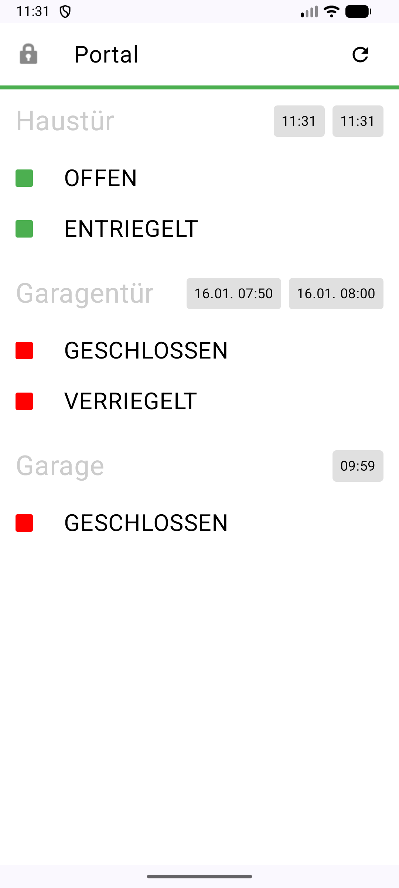
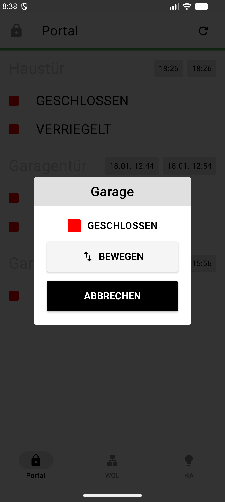
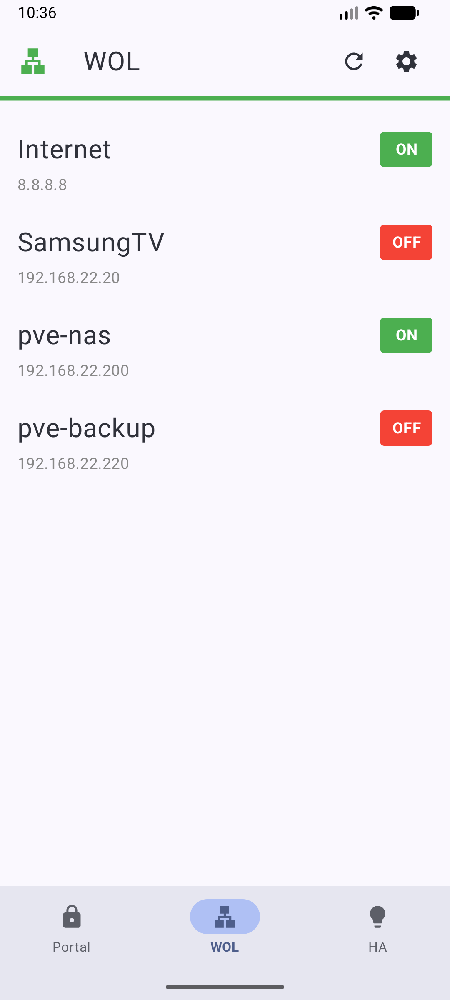

#  MuhPortal

An Android application built with Kotlin and Jetpack Compose to monitor and control a smart home via MQTT over WebSockets.

## Features

- **Portal Control**: Monitor and toggle garage, garage door, and house door states in real time.
- **Wake-on-LAN**: Wake and shut down networked machines; shows live online/offline status.
- **Home Automation (HA tab)**:
  - Temperature and humidity sensors
  - Solar PV power and daily production
  - Energy meter (consumption, import, export)
  - Heater (Brenner) and zone (Kommer) switch control
  - **Alarm system**: arm/disarm with live alert feed
- **Connection Management**: Automatic reconnection, visual status bar (green/yellow/red).
- **Local Cache**: Last-known state persisted to SharedPreferences, restored on launch.
- **Configurable**: All MQTT topics, device IDs, and sensor JSON keys editable in-app settings.
- **Dark mode & high-contrast** (black/white) accessibility mode.

## Screenshots

<p align="center">
  
  
  
</p>

## Technical Specifications

| | |
|---|---|
| Language | Kotlin |
| UI | Jetpack Compose / Material3 |
| Build | Gradle (Kotlin DSL) |
| MQTT library | Eclipse Paho MQTT Client 1.2.5 |
| Protocol | MQTT over WebSockets |
| Min SDK | 28 (Android 9) |
| Target SDK | 35 (Android 15) |

## MQTT Architecture

### Portal tab

| Direction | Topic | Payload |
|---|---|---|
| Subscribe | `muh/portal/+/json` | `{"state":0\|1, "ts":"..."}` |
| Publish | `muh/portal/RLY/cmnd` | `G_T`, `GD_O`, `GD_U`, `GD_L`, `HD_O`, `HD_U`, `HD_L` |

Portal keys: `G` Garage · `GD` Garage Door · `GDL` Garage Door Lock · `HD` House Door · `HDL` House Door Lock

### WoL tab

| Direction | Topic | Payload |
|---|---|---|
| Subscribe | `muh/pc/+` | `{"name":"…","ip":"…","mac":"…","alive":true}` |
| Publish | `muh/wol` | `{"mac":"…"}` |
| Publish | `muh/poweroff` | `{"mac":"…"}` |

### HA tab

| Direction | Topic | Payload |
|---|---|---|
| Subscribe | `muh/sensors/#` | JSON with temp/humidity fields |
| Subscribe | `muh/wst/data/+` | JSON weather station data |
| Subscribe | `muh/pv/+/json` | `{"data":{"p1":…,"p2":…,"e1":…,"e2":…}}` |
| Subscribe | `tasmota/tele/+/STATE` | Tasmota state JSON |
| Subscribe | `tasmota/tele/+/SENSOR` | Tasmota sensor/energy JSON |
| Subscribe | `tasmota/stat/+/RESULT` | Tasmota command result |
| Publish | `tasmota/cmnd/{id}/POWER` | `0` or `1` |

#### Alarm System

| Direction | Topic | QoS | Retain | Payload |
|---|---|---|---|---|
| Subscribe | `muh/alarm/state` | 1 | yes | `ARM_AWAY` \| `ARM_HOME` \| `DISARM` |
| Subscribe | `muh/alarm/alert` | 1 | no | `{"device":"…","label":"…","alarmState":"…","time":"HH:mm:ss","ts":"…"}` |
| Publish | `muh/alarm/set` | 1 | no | `ARM_AWAY` \| `ARM_HOME` \| `DISARM` |

## Installation

### On a physical device

1. Enable **Developer Options** and **USB Debugging** on the device.
2. Connect via USB, then:
   ```bash
   ./gradlew assembleDebug
   adb install app/build/outputs/apk/debug/app-debug.apk
   ```

### On a Linux emulator

**Prerequisites**: Android Studio installed (includes the emulator and `sdkmanager`).

1. **Create an AVD** via Android Studio → *Device Manager* → *Create Virtual Device*, or from the command line:
   ```bash
   # List available system images
   sdkmanager --list | grep "system-images;android-35"

   # Download a system image (x86_64 for speed)
   sdkmanager "system-images;android-35;google_apis;x86_64"

   # Create the AVD
   avdmanager create avd -n MuhPortal -k "system-images;android-35;google_apis;x86_64" --device "pixel_6"
   ```

2. **Start the emulator**:
   ```bash
   # The emulator binary lives in $ANDROID_HOME/emulator/
   emulator -avd MuhPortal -no-snapshot-load &
   ```
   If KVM is not available, add `-accel off` (much slower):
   ```bash
   emulator -avd MuhPortal -no-snapshot-load -accel off &
   ```
   Enable KVM on Linux for full speed:
   ```bash
   sudo apt install qemu-kvm
   sudo usermod -aG kvm $USER   # log out and back in after this
   ```

3. **Build and install**:
   ```bash
   ./gradlew assembleDebug
   adb install app/build/outputs/apk/debug/app-debug.apk
   ```

4. **MQTT broker reachability**: the emulator's `10.0.2.2` routes to the host's `127.0.0.1`. If your broker runs on the host, set the Server URI in app settings to `ws://10.0.2.2:1884`. For a broker on another LAN host, use its normal IP.

## Building a release APK

Set the keystore environment variables, then:

```bash
export KEYSTORE_PATH=/path/to/release.keystore
export KEYSTORE_PASSWORD=...
export KEY_ALIAS=...
export KEY_PASSWORD=...

./gradlew assembleRelease
# Output: app/build/outputs/apk/release/app-release.apk
```
